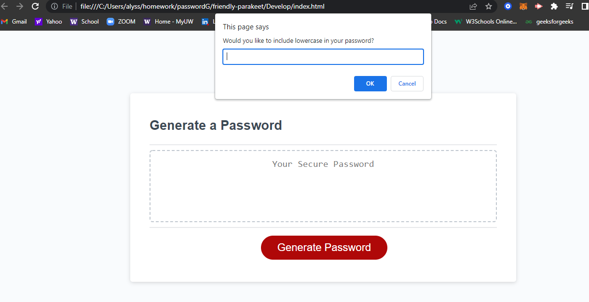

<h1> Challenge #3 </h1>

For this weeks challenge, we were asked to follow the acceptence criteria to generate a random password after a series of prompts and inputs.

<h2> Acceptence Criteria</h2>

<li> When the user clicks on "generate password" button then the user is prosented with promopts that meets password criteria.</li>
<li> The prompts needed to to ask for length of password 8 - 128, number, lowercase, uppercase, and special characters</li>
<li>  When all of the prompts are answered then the password is generated on the in an alert or is written on the page</li>

<h1> Screenshot: </h1>

Link to deployed repo: 

